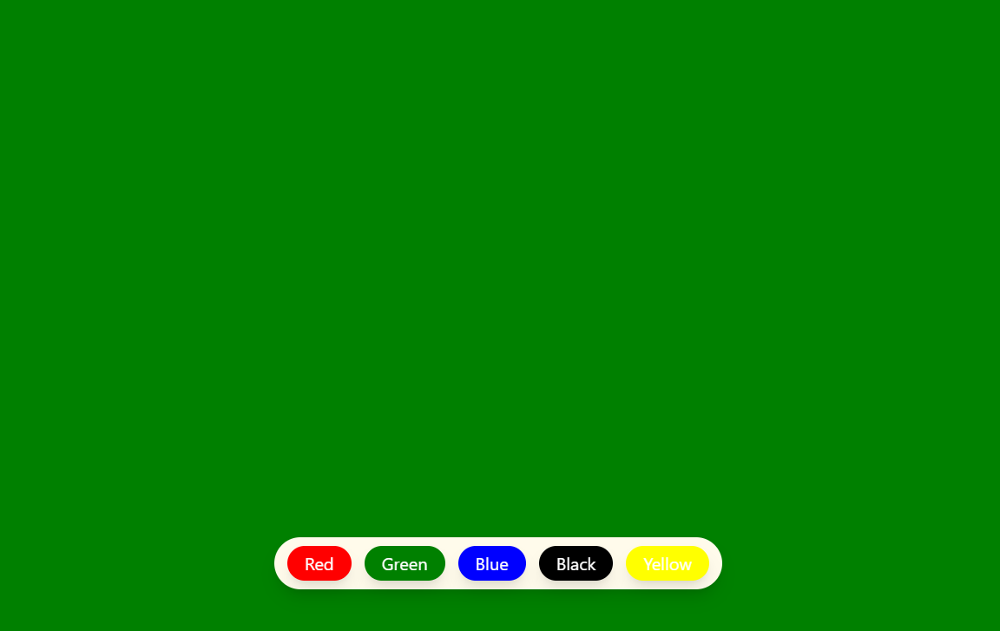

# React Background Color Changer

This project allows users to change the background color of the screen using **ReactJS** and **Tailwind CSS**.  
It demonstrates the use of the `useState` hook to update the color dynamically.

## Features

- Change background color by clicking buttons
- Smooth transitions with Tailwind CSS
- Responsive and modern UI

## Technologies Used

- ReactJS
- Tailwind CSS

## How It Works

- The app uses React’s `useState` hook to manage the background color.
- Tailwind CSS is used for styling buttons and layout.
- Clicking a color button updates the background color of the screen.

## Screenshot

